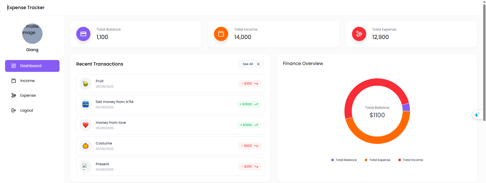
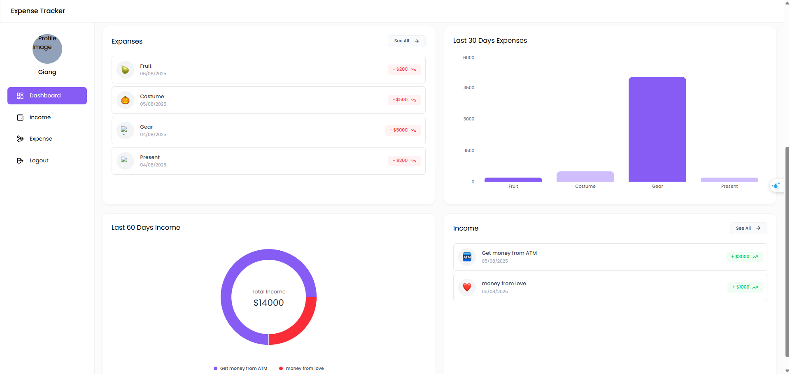
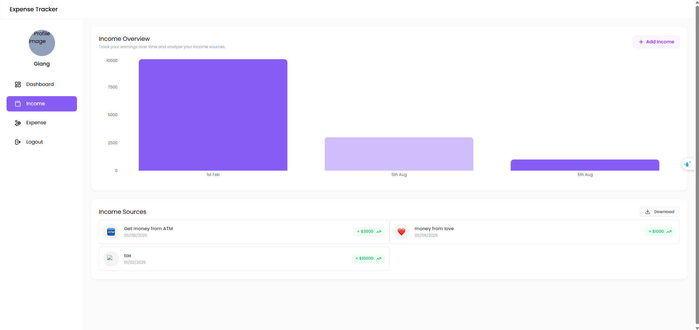
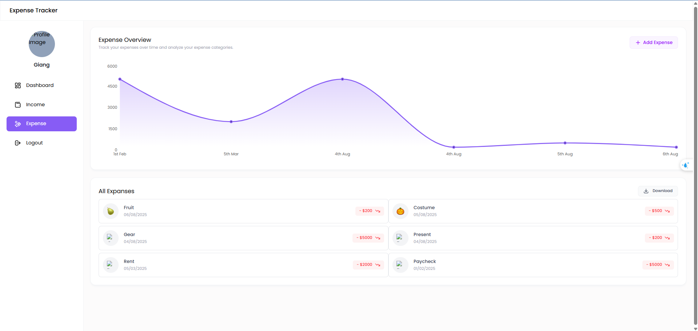
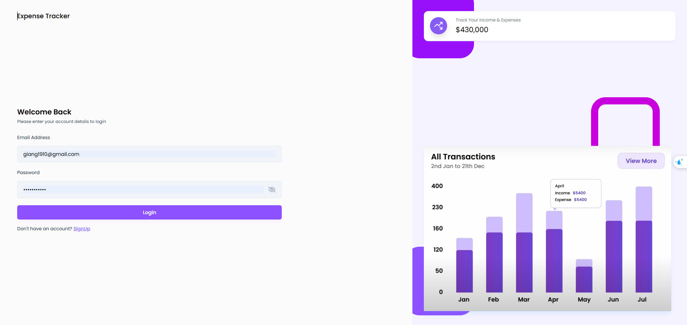
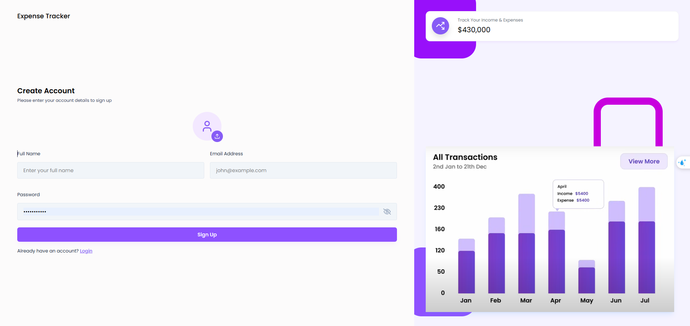

# 💰 Expense Tracker App

A simple and user-friendly web application to help you manage your personal finances.  
Track your daily expenses, categorize transactions, and visualize spending patterns through interactive charts.

## 📋 Features
- User Authentication: Login & Logout
- Expense & Income Management: Add, edit, and delete records
- Data Export: Download income and expense data as a file
- Real-Time Balance Updates: Instantly see your remaining balance after changes
- Spending Analysis: Interactive charts for visualizing income and expense trends

## 🛠️ Tech Stack
- Frontend: React.js
- Backend:Node.js, Express
- Database: MongoDB 
- Charts: Chart.js

## 🚀 Installation
  1. Clone the repository
  2. Install the dependencies: npm install
  3. Navigate to the frontend/expense-tracker folder
  4. Run the React.js frontend: npm run dev
  5. Navigate to the backend
  6. Run the Node.js backend: npm run dev
  7. Access the application at http://localhost:5173 in your web browser.

 ## Screenshots

  ### Dashboard
   
   

  ### Income & Expense
   
   

  ### Authentication
   
   

